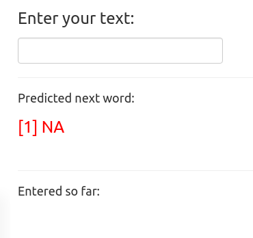

Coursera Data Science Capstone Project
========================================================
author: Luka Santrić

The presentation will briefly showcase an [application](https://lsantric.shinyapps.io/ShinyApp_-_AutoComplete/) for predicting the next word in a sentance based on previously chosen words.

The application is the capstone project for the Coursera Data Science specialization organized by Johns Hopkins University in cooperation with SwiftKey.

The Objective
========================================================

In the capstone project, the main goal was to build a shiny application that is able to predict the next word a user wants to type. 

It included multiple tasks ranging from data cleansing and exploratory analysis to creation of a predictive model and more.

Data used in this course is available on [HC Corpora](http://www.corpora.heliohost.org/). 

All data processing was done with R and its numerous packages.

Method and modeling
========================================================

After downloading the data set, It was filtered by conversion to lowercase, removing punctuation, links, white spaces, numbers and all special characters.

The data sample was tokenized into [*n*-grams](http://en.wikipedia.org/wiki/N-gram).

Those aggregated n-grams frequency matrices have been transferred into frequency dictionaries.

The resulting data tables were used to predict the next word in connection with the input text. 

Using the Application
========================================================

The user interface of this application is very simple. While entering the text, the field with the predicted next word refreshes automatically and the whole input text is displayed.

Additional Information
========================================================

* The ShinyApp is hosted on shinyapps.io: [https://lsantric.shinyapps.io/ShinyApp_-_AutoComplete/](https://lsantric.shinyapps.io/ShinyApp_-_AutoComplete/)

* Git repository available at: 

