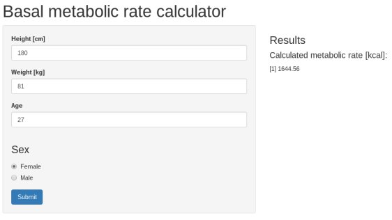

##Introduction


BMR (Basal Metabolic Rate, also known as Resting Metabolic Rate) is the number of Calories a body uses when in a resting state for a complete day. It uses the Harris-Benedict equations to estimate your BMR from gender, weight, height and age. Estimating BMR is important in planning colorie intake to achieve or maintain healthy body weight.

These are the most widely used equations and the only factor they omit is lean body mass. Thus, the ratio of muscle-to-fat a body has. Since muscle burns more calories than fat, these equation tend to underestimate the calorie needs of very muscular people (bodybuilders, some athletes) and overestimate the calorie needs of obese people.

##The Formula


```r
    if (Sex == 1) {
      665.09 + (9.56 * Weight) + (1.84 * Height) - (4.67 * Age)
    } else {
      66.47 + (13.75 * Weight) + (5.0 * Height) - (6.75 * Age)
    }
```

The Harris–Benedict equation (also called the Harris-Benedict principle) is a method used to estimate an individual's basal metabolic rate (BMR) and daily kilocalorie requirements. The estimated BMR value can be multiplied by a number that corresponds to the individual's activity level. The resulting number is the recommended daily kilocalorie intake to maintain current body weight. Formula differs for different sexes, 1 being female.
  

##Using Application



 
 Using BMR calculator is straightforward. Enter height, weight, age and sex and it will display how much calories your body uses in a day while resting.

##Get application

BMR calculator is available [here](https://lsantric.shinyapps.io/BMRcalc/).


