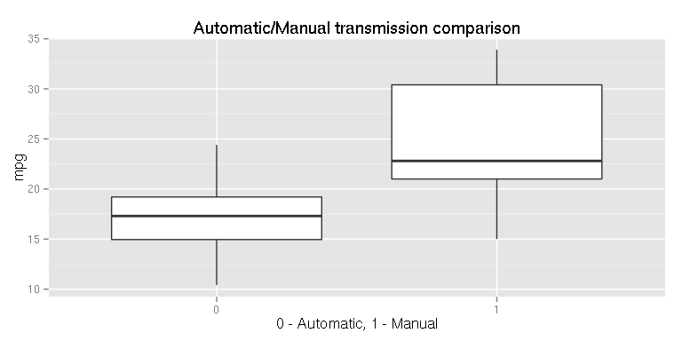
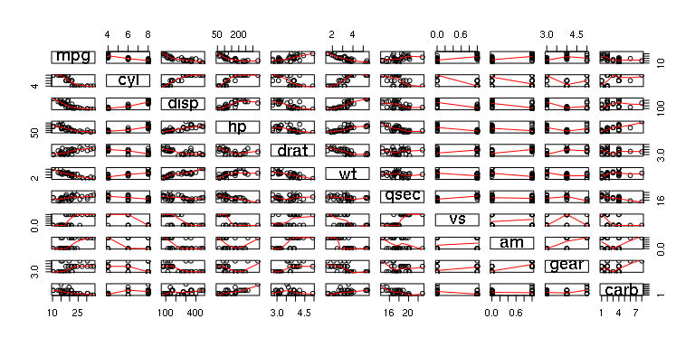
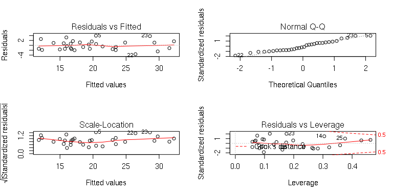

# Regression models: Motor Trend - Project report

## Introduction / Executive summary

This project looks into a data set of a collection of cars and explores the relationship between a set of variables and miles per gallon (MPG) (outcome). It focuses on answering the following two questions using regression models and exploratory data analysis:

1. Is an automatic or manual transmission better for MPG?
2. Quantify the MPG difference between automatic and manual transmissions?

It concludes that manual transmition is better for MPG and quantifies its impact on it.

## Exploring the mtcars data set

In this project "Motor Trend Car Road Tests" data set is used. It was extracted from the 1974 Motor Trend US magazine, and comprises fuel consumption and 10 aspects of automobile design and performance for 32 automobiles (1973–74 models). It consists of a data frame with 32 observations on 11 variables in following format:


[, 1]	 mpg	 Miles/(US) gallon
[, 2]	 cyl	 Number of cylinders
[, 3]	 disp	 Displacement (cu.in.) 
[, 4]	 hp	 Gross horsepower 
[, 5]	 drat	 Rear axle ratio 
[, 6]	 wt	 Weight (lb/1000) 
[, 7]	 qsec	 1/4 mile time 
[, 8]	 vs	 V/S 
[, 9]	 am	 Transmission (0 = automatic, 1 = manual) 
[,10]	 gear	 Number of forward gears 
[,11]	 carb	 Number of carburetors 


```r
library(data.table)
library(ggplot2)

data("mtcars")
mtcars <- data.table(mtcars)
```

This project's main concern is discovering the effects of the type of transmission used in a car on its fuel consomption. As it can be seen on the transmission comparison boxplot below, cars with automatic transmission have lower mpg and consume more fuel on average.


```r
ggplot(mtcars, aes(factor(am), mpg)) +
  xlab("0 - Automatic, 1 - Manual") +
  geom_boxplot() +
  ggtitle("Automatic/Manual transmission comparison")
```

 

It is important to check for statistical signifacance of formualted hypothesis. It is necessary to do a two sample t-test and test hypothesis that mpg on cars with manual transmition is greater.


```r
setkey(mtcars, am)
p <- t.test(mtcars[am == 1,mpg], mtcars[am == 0,mpg], alternative = "greater")
print(p)
```

```
## 
## 	Welch Two Sample t-test
## 
## data:  mtcars[am == 1, mpg] and mtcars[am == 0, mpg]
## t = 3.7671, df = 18.332, p-value = 0.0006868
## alternative hypothesis: true difference in means is greater than 0
## 95 percent confidence interval:
##  3.913256      Inf
## sample estimates:
## mean of x mean of y 
##  24.39231  17.14737
```

T-test confirms our hypothesis, automatic transmission has lower mpg on average.

To get some sense of the relationship between other varibles, ploting its pairwise scatter plots is useful:


```r
pairs(mtcars, panel=panel.smooth)
```

 

## Modeling using linear regression

To quantify the effect different transmissions have on mpg and control for other variables, linear regression is used. At first, all variables are used to construct a model.


```r
allModel <- lm(mpg ~ ., data=mtcars)
summary(allModel)
```

When all variables are used, models residual standard error is 2.65, Adjusted R-squared is 0.8066 and none of the coefficients are statistically significant. This model explains ~80% of variance. It is possible to automatically exclude variables which don't contribute to prediction using step() to get better results.


```r
reducedModel <- step(allModel, direction = "both")
summary(reducedModel)
```

This model uses only wt,qsec and am variables, explains ~83% variance and has all significant variables. Additional imprevements can be gained by adding variable interactions to model.


```r
reducedIntModel <- step(reducedModel, scope = . ~ .^2, direction = 'both')
summary(reducedIntModel)
```

New model includes bilinear interaction between wt:am and wt:qsec and explains ~88% of variance.

Based on models shown, we can expect that when "wt" and "qsec"  remain constant, cars with manual transmission add "14 - 4.141 * wt * am - 0.54 * wt * qsec" more "mpg" than cars with automatic transmission.

## Residual diagnosis


```r
par(mfrow = c(2, 2))
plot(reducedIntModel)
```

 

Residual diagnosis concludes that residuals are normally distributed, there are no outliers and variance is constant.
