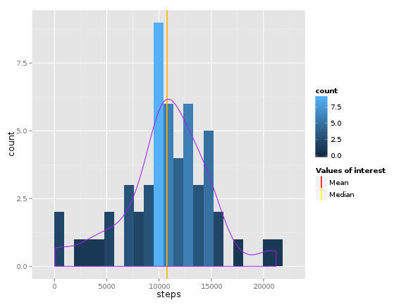
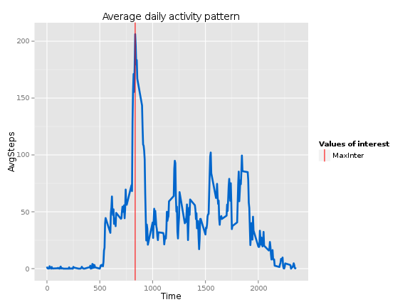
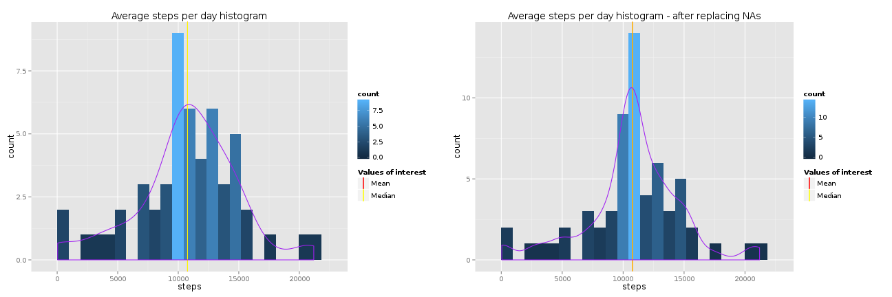
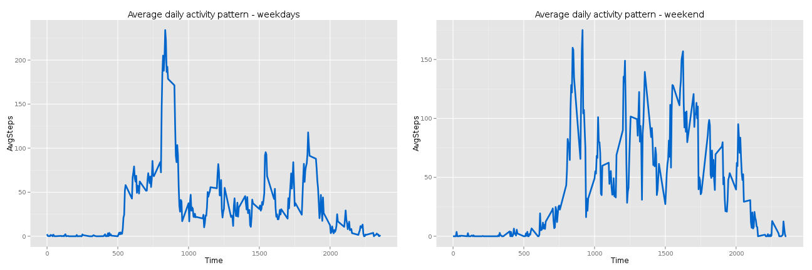

## Introduction

It is now possible to collect a large amount of data about personal movement using activity monitoring devices such as a Fitbit, Nike Fuelband, or Jawbone Up. These type of devices are part of the “quantified self” movement – a group of enthusiasts who take measurements about themselves regularly to improve their health, to find patterns in their behavior, or because they are tech geeks. But these data remain under-utilized both because the raw data are hard to obtain and there is a lack of statistical methods and software for processing and interpreting the data.

This assignment makes use of data from a personal activity monitoring device. This device collects data at 5 minute intervals through out the day. The data consists of two months of data from an anonymous individual collected during the months of October and November, 2012 and include the number of steps taken in 5 minute intervals each day.

## Loading and preprocessing the data

```r
library(data.table)
library(ggplot2)
library(gridExtra)
activity <- fread ("activity.csv")
```


## What is mean total number of steps taken per day?

```r
activityPD <- activity[!is.na(activity[,steps]),sum(as.numeric(as.character(steps)), na.rm = TRUE), by=date]

setnames(activityPD, "V1", "steps")

meanStep <- mean (activityPD[, steps])
medianStep <- median (activityPD[,steps])
```


```r
ggplot(activityPD, aes( x = steps ) ) + 
     geom_histogram(aes(fill = ..count..), binwidth = 950) +
     geom_vline(aes(xintercept = meanStep, 
                 colour = "Mean"),
                 show_guide = TRUE) +
     geom_vline(aes(xintercept = medianStep, 
                 colour = "Median"),
                 show_guide = TRUE) +
     geom_density(aes(y = 1000 * ..count..), colour = "purple") +
     scale_colour_manual(name="Values of interest", values=c(Median="yellow",Mean="red"))
```

 
      
The mean and median of the total number of steps taken per day are 1.0766189 &times; 10<sup>4</sup>, 1.0765 &times; 10<sup>4</sup> and are marked on histogram.

## What is the average daily activity pattern?

```r
activityPI = activity[, mean(as.numeric(as.character(steps)), na.rm = TRUE), by = interval]
setnames(activityPI, c("interval", "V1"), c("Time", "AvgSteps"))
setkey(activityPI, Time)
peakInter <- activityPI[which (activityPI[, AvgSteps] == max (activityPI[, AvgSteps])),
                          "Time",with = FALSE]
```


```r
ggplot(activityPI, aes( x = Time, y = AvgSteps) ) + 
    geom_line(size=1.25, colour = "#0066CC") +
    geom_vline(aes(xintercept = as.numeric(peakInter), colour = "MaxInter"), show_guide = TRUE) +
    scale_colour_manual(name="Values of interest", values=c(MaxInter = "red")) +
    ggtitle("Average daily activity pattern") 
```

 

Peak average daily activity is at interval 835 which is marked on plot.

## Imputing missing values

Chosen strategy for dealing with missing values is replacing them with that intervals global averages (averaged across all days).


```r
removeNA <- function (x, y) {

  if (is.na(x)) { 
    return(activityPI[list(y), AvgSteps])
    } else {
      return (x)
      }
}

activity2 <- copy(activity)

activity2 <- activity2[, steps := as.double(steps)]

activity2[, steps := removeNA(.SD, interval), by = c("date", "interval")]

nuNa <- sum(is.na(activity))

activityPD2 <- activity2[,sum(as.numeric(as.character(steps)), na.rm = TRUE), by=date]
setnames(activityPD2, "V1", "steps")

meanStep2 <- mean (activityPD2[, steps])
medianStep2 <- median (activityPD2[,steps])

p1 <- ggplot(activityPD, aes( x = steps ) ) + 
     geom_histogram(aes(fill = ..count..), binwidth = 950) +
     geom_vline(aes(xintercept = meanStep, 
                 colour = "Mean"),
                 show_guide = TRUE) +
     geom_vline(aes(xintercept = medianStep, 
                 colour = "Median"),
                 show_guide = TRUE) +
     geom_density(aes(y = 1000 * ..count..), colour = "purple") +
     ggtitle("Average steps per day histogram") +
     scale_colour_manual(name="Values of interest", values=c(Median="yellow",Mean="red"))
     

p2 <- ggplot(activityPD2, aes( x = steps ) ) + 
     geom_histogram(aes(fill = ..count..), binwidth = 950) +
     geom_vline(aes(xintercept = meanStep2, 
                 colour = "Mean"),
                 show_guide = TRUE) +
     geom_vline(aes(xintercept = medianStep2, 
                 colour = "Median"),
                 show_guide = TRUE) +
     geom_density(aes(y = 1000 * ..count..), colour = "purple") +
     ggtitle("Average steps per day histogram - after replacing NAs") +
     scale_colour_manual(name="Values of interest", values=c(Median="yellow",Mean="red"))
```

Number of missing values is 2304.


```r
grid.arrange(p1,p2,ncol=2)
```

 

After implementation of missing values replacement strategy, impact on the data set is clearly visible. Data sets variance is smaller, more tightly grouped around its distributions mean value.

## Are there differences in activity patterns between weekdays and weekends?

```r
activity3 <- copy(activity)
activity3[, day := weekdays(as.Date(activity3[,date]))]
weekDays <- c("Monday", "Tuesday", "Wednesday", "Thursday", "Friday")
weekendDays <- c("Saturday", "Sunday")
setkey(activity3, day)
activityPIweekday = activity3[weekDays, mean(as.numeric(as.character(steps)),na.rm = TRUE),
                              by = interval]
activityPIweekend = activity3[weekendDays, mean(as.numeric(as.character(steps)),na.rm = TRUE),
                              by = interval]

setnames(activityPIweekday, c("interval", "V1"), c("Time", "AvgSteps"))
setnames(activityPIweekend, c("interval", "V1"), c("Time", "AvgSteps"))

q1 <- ggplot(activityPIweekday, aes( x = Time, y = AvgSteps) ) +
        geom_line(size=1.25, colour = "#0066CC") +
        ggtitle("Average daily activity pattern - weekdays") 

q2 <- ggplot(activityPIweekend, aes( x = Time, y = AvgSteps) ) +
        geom_line(size=1.25, colour = "#0066CC") +
        ggtitle("Average daily activity pattern - weekend") 
```


```r
grid.arrange(q1,q2,ncol=2)
```

 

There are clearly visible activity pattern differences.
