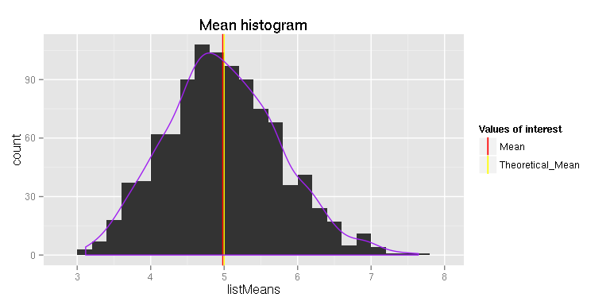
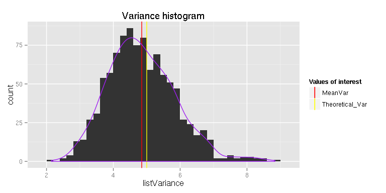
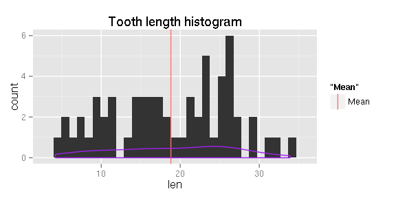
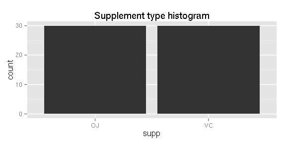
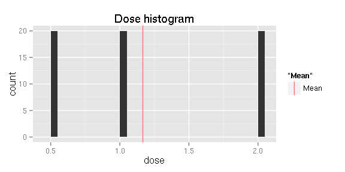

# Statistical Inference: Project report

## Part 1 -Introduction

This project investigates the exponential distribution in R and compares it with the Central Limit Theorem. The exponential distribution can be simulated in R with rexp(n, lambda) where lambda is the rate parameter. The mean of exponential distribution is 1/lambda and the standard deviation is also 1/lambda. Lambda is se to 0.2 for all of the simulations. Simulations are repeated thousand times with samples of 40 numbers generated with exponential distribution.

It will ilustrate via simulation and associated explanatory text the properties of the distribution of the mean of 40 exponentials.  It should

1. Show the sample mean and compare it to the theoretical mean of the distribution.
2. Show how variable the sample is (via variance) and compare it to the theoretical variance of the distribution.
3. Show that the distribution is approximately normal.

## Calculating sample's mean and variation

The following r code takes 40 samples with exponential distribution and calculates its variance and mean. Then repeats that simulation a thousand times and plots variance and mean histograms of the given data.


```r
library(data.table)
library(ggplot2)
library(gridExtra)

listMeans <- data.table(unlist(lapply(1:1000, function (x) { mean(rexp(40, 0.2)) })))
listVariance <- data.table(unlist(lapply(1:1000, function (x) { sd(rexp(40, 0.2)) })))
setnames(listMeans, "listMeans")
setnames(listVariance, "listVariance")
Mean <- mean(listMeans[,listMeans])
MeanVariance <- mean(listVariance[,listVariance])
```


```r
ggplot(listMeans, aes(x=listMeans)) +
  geom_histogram(bin=0.2) + 
  ggtitle("Mean histogram") +
  geom_vline(aes(xintercept = Mean,colour = "Mean"),show_guide = TRUE) +
  geom_vline(aes(xintercept = 1/0.2,colour = "Theoretical_Mean"),show_guide = TRUE) +
  geom_density(aes(y = 0.2 * ..count..), colour = "purple") +
  scale_colour_manual(name="Values of interest", values=c(Theoretical_Mean="yellow",Mean="red"))
```

 

```r
ggplot(listVariance, aes(x=listVariance)) +
  geom_histogram(bin=0.2) + 
  ggtitle("Variance histogram") +
  geom_vline(aes(xintercept = MeanVariance,colour = "MeanVar"),show_guide = TRUE) +
  geom_vline(aes(xintercept = 1/0.2, colour = "Theoretical_Var"),show_guide = TRUE) +
  geom_density(aes(y = 0.2 * ..count..), colour = "purple") +
  scale_colour_manual(name="Values of interest", values=c(Theoretical_Var="yellow",MeanVar="red"))
```

 

We can see that distribution of sample means and variances closely resemble normal distribution and that sample's expected mean of 4.9811309 and Variance of 4.8500734 are very close to theoretical values of 5.


## Part 2 -Introduction 

In the second portion of the project, ToothGrowth data in the R datasets package will be analyzed and includes:

Loading of the ToothGrowth data and performing some basic exploratory data analyses
Providing a basic summary of the data.
Using confidence intervals and/or hypothesis tests to compare tooth growth by supp and dose.
Conclusions and the assumptions needed for conclusions.

## ToothGrowth data analysis

ToothGrowth dataset cotnains data on the effects of vitamin C on tooth growth in guinea pigs. The response is the length of odontoblasts (teeth) in each of 10 guinea pigs at each of three dose levels of Vitamin C (0.5, 1, and 2 mg) with each of two delivery methods (orange juice or ascorbic acid).

A data frame with 60 observations on 3 variables.

[,1]	 len	 numeric	 Tooth length
[,2]	 supp	 factor	 Supplement type (VC or OJ).
[,3]	 dose	 numeric	 Dose in milligrams.

The following code plots histogram for each of the variables:


```r
ToothGrowth <- data.table(ToothGrowth)
ggplot(ToothGrowth, aes(x=len)) +
  geom_histogram() + 
  ggtitle("Tooth length histogram") +
  geom_vline(aes(xintercept = mean(ToothGrowth[,len]),colour = "Mean"),show_guide = TRUE) +
  geom_density(aes(y = 0.2 * ..count..), colour = "purple")
```

 

```r
ggplot(ToothGrowth, aes(x=supp)) +
  geom_histogram(bin=0.5) + 
  ggtitle("Supplement type histogram")
```

 

```r
ggplot(ToothGrowth, aes(x=dose)) +
  geom_histogram() + 
  ggtitle("Dose histogram") +
  geom_vline(aes(xintercept = mean(ToothGrowth[,dose]),colour = "Mean"),show_guide = TRUE)
```

 

